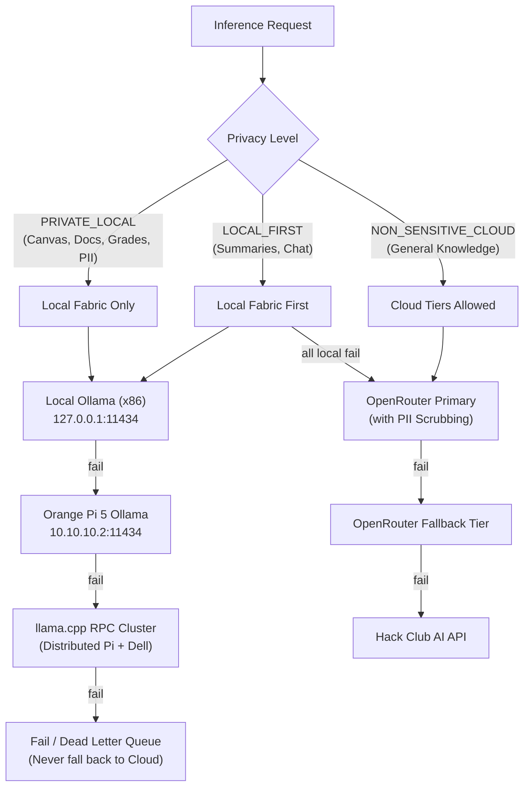

# AI Developer Context — pab-core

> **Audience**: AI Coding Agents (Antigravity, Claude, Codex, Cursor, etc.) and software engineers modifying, maintaining, or debugging the `pab-core` codebase.
> This document establishes the architectural context, system invariants, execution paths, subsystem boundaries, and operational rules required to safely navigate and modify this repository.

---

## 1. System Mission & Core Constraints

`pab-core` is the application tier of a self-hosted, privacy-first personal assistant bot designed for a single owner (a high-school student). It ingests coursework from Canvas, Google Classroom/Docs, and GroupMe, builds periodic digests and study material, answers user queries over chat, and maintains an assignment calendar.

### Cardinal Invariants
1. **Single-Tenant & Owner-Only**: The bot strictly serves the configured `TELEGRAM_OWNER_USER_ID`. Every incoming command, message, callback, and API bridge route must pass through the security perimeter in `bot/security.py`.
2. **Local-First & Privacy Boundary**: All student coursework, grades, personal emails, notes, and school messages are strictly classified as private data. They MUST NEVER be dispatched to public cloud LLMs without explicit classification and sanitization. All logging and external transit must pass through `utils.scrub_pii()`.
3. **Transactional State & Concurrency Safety**: All state persistence (`state.json`, `.nightly_queue.json`, dead-letter queues) must utilize atomic file writes and file locks (`.lock`) via `bot/storage.py` and `bot/state.py` to prevent state corruption during power loss or concurrent execution.
4. **No Direct Database Daemon**: State and knowledge are stored in structured JSON files, vector indices (`.npz`), and markdown/docx files. Do not introduce monolithic SQL/NoSQL database servers.
5. **No Phantom Artifacts in Syncthing**: The `study_guides/` directory is synchronized via Syncthing directly into the user's Obsidian Vault. Never drop temporary files, logs, or intermediate raw caches in `study_guides/`; use `source_cache/`, `cache/`, or `logs/`.

---

## 2. Tri-Repo Ecosystem & Boundaries

The project is split into three decoupled repositories:

```
┌─────────────────────────────────────────────────────────────────────────────┐
│                          pab-core (This Repo)                               │
│  Telegram Bot (main.py), Scrapers, LLM Router, Digest, Calendar, Ingest     │
└──────────────────────┬───────────────────────────────┬──────────────────────┘
                       │                               │
                       ▼                               ▼
┌────────────────────────────────────────┐ ┌──────────────────────────────────┐
│           pab-ops (Infra)              │ │    pab-study-content (Data)      │
│ Systemd units, health checks, timers,  │ │ Generated Markdown/Word study    │
│ multi-node llama.cpp RPC cluster ops   │ │ guides, knowledge base, SAT prep │
└────────────────────────────────────────┘ └──────────────────────────────────┘
```

- **`pab-core` (Public)**: Contains all business logic, scrapers, bot interfaces, AI bridges, and service scripts.
- **`pab-ops` (Public)**: Holds host-level systemd service files, timers, health-check scripts, and distributed RPC cluster management.
- **`pab-study-content` (Private)**: Holds the generated study guides, SAT master guides, and knowledge base notes.

---

## 3. Codebase Architecture & File Map

```
.
├── main.py                     # Entry point for bot.service (Telegram long-poll, scheduler)
├── config.py                   # Central configuration & environment variables (Single Source of Truth)
├── llm_router.py               # Unified LLM dispatcher, local/cloud routing, cost tracking
├── ai_processor.py             # Per-source extraction passes, local model summarization
├── utils.py                    # Shared utilities: scrub_pii, atomic file helpers, backups
├── activity_log.py             # Privacy-scrubbed structured activity logging
├── nightly_processor.py        # Overnight lossless document processor & study guide updater
├── practice_grader.py          # Automated SAT/ACT practice test grading logic
├── voice_handler.py            # Local voice note transcription (faster-whisper)
├── inline_keyboards.py         # Telegram UI interactive inline keyboards
│
├── bot/                        # Telegram-Facing Subsystem
│   ├── commands.py             # Slash commands (/start, /summary, /model, /canvas, etc.)
│   ├── ai_bridge.py            # Privacy-preserving chat <-> LLM Router bridge
│   ├── ui.py                   # HTML escaping, message chunking, formatting primitives
│   ├── state.py                # State manager wrapper with in-memory caching & bounded sets
│   ├── storage.py              # Atomic JSON read/write primitives with file-locking
│   ├── security.py             # Access control (strict owner ID verification)
│   ├── runtime.py              # Background task lifecycle tracking
│   └── dashboard_state.py      # Route state provider for HTTP dashboard
│
├── scrapers/                   # Data Ingestion & Transformation Tier
│   ├── canvas_scraper.py       # Canvas scraper via authenticated Firefox daemon
│   ├── canvas_page_extractor.py# Parses raw Canvas HTML pages into structured tasks
│   ├── google_scraper.py       # Google Classroom, Docs, Drive, and Gmail ingest
│   ├── composio_fetcher.py     # Composio-based Google data integration
│   ├── groupme_scraper.py      # GroupMe class chat scraper and announcement parser
│   ├── notion_client.py        # Notion workspace integration and task syncer
│   ├── assignment_calendar.py  # CalDAV (Radicale) & Google Calendar synchronization
│   ├── google_docs_calendar.py # Extracts deadlines from Google Docs with approval gates
│   ├── morning_digest.py       # Periodic digest builder (runs every 4 hours)
│   ├── mega_study_builder.py   # Multi-stage textbook & study guide compiler
│   ├── embedding_indexer.py    # Incremental vector indexing (nomic-embed-text via Ollama)
│   ├── semantic_retrieval.py   # Cosine similarity vector search over embedding index
│   └── batch_results.py        # Typed validation and status tracking for batch jobs
│
├── scripts/                    # Daemons & CLI Tooling Executed by Services
│   ├── canvas_browser_daemon.py# Persistent Firefox daemon for ClassLink SSO (port 8976)
│   ├── dashboard_agent.py      # Status dashboard web agent (port 8765)
│   └── generate_daily_digest.py# Standalone trigger for digest creation
│
├── tests/                      # pytest test suite (160+ unit & integration tests)
└── docs/                       # Architecture diagrams, runbooks, and historical audits
```

---

## 4. LLM Routing & Privacy Architecture

The `llm_router.py` module governs all inference requests. It applies a multi-tier fallback ladder based on task sensitivity:



### Key AI Routing Rules
- **Never bypass `llm_router`**: Do not call `requests.post` to OpenAI/OpenRouter directly from scrapers or commands.
- **PII Scrubbing**: `utils.scrub_pii()` strips student names, school identifiers, specific URLs, emails, and phone numbers before any outbound cloud dispatch.
- **RPC Cluster Budget**: The RPC cluster uses distributed tensor splitting across local devices. Fallback timeouts must be budgeted to prevent hanging Telegram long-polling loops.

---

## 5. Ingestion & Data Flow Details

### 1. Canvas Ingestion via Persistent Browser Session
- Canvas is protected behind ClassLink SSO with MFA. It cannot be accessed via a simple static API token.
- `scripts/canvas_browser_daemon.py` runs as `canvas-browser.service` (port `8976`), maintaining an authenticated Firefox session.
- `canvas_scraper.py` queries `http://127.0.0.1:8976/` to fetch raw HTML pages, which `canvas_page_extractor.py` parses into structured assignments.

### 2. Google Drive / Classroom / Docs
- Google APIs authenticate using OAuth tokens (`token.json` / `credentials.json`).
- Always use `supportsAllDrives=True` and `corpora="allDrives"` on Google Drive API queries to prevent missed classroom files.
- Google Docs deadlines are parsed via `google_docs_calendar.py` and require approval before landing on Google Calendar.

### 3. CalDAV & Assignment Sync
- Local assignments are synced directly to a self-hosted Radicale CalDAV server (`0.0.0.0:5232`).
- `scrapers/assignment_calendar.py` enforces deduplication by assignment title and course code.

### 4. Semantic Vector Retrieval
- `scrapers/embedding_indexer.py` generates 768-dimensional embeddings using `nomic-embed-text` hosted on Ollama.
- Vectors, document chunks, and MD5 hashes are saved to `embedding_data/embedding_index.npz`.
- Indexing is incremental: only modified files are re-embedded.
- At chat query time, `semantic_retrieval.get_context_for_prompt()` extracts the top-$K$ cosine similarity chunks to inject into the LLM context.

---

## 6. Nightly Processing & State Durability

### Nightly Batch Cycle (2:00 AM)
1. Ingests raw queued items from `.nightly_queue.json`.
2. Runs OCR on new PDF/image classroom attachments.
3. Performs **Delta Updates** to study guides (appends new extracted notes to existing guides in `study_guides/` rather than re-generating 400KB+ files from scratch).
4. Unprocessed or failed items are moved to `.nightly_dead_letter.json` for operator review without dropping data.
5. Rebuilds the semantic embedding index incrementally.

### State & Storage Management
- File: `state.json` tracks `seen_tasks`, `last_digest_time`, `active_topics`, and user preferences.
- Reads/writes MUST go through `bot/storage.py` (`load_json_atomic`, `save_json_atomic`) or `bot/state.py`.
- `seen_tasks` uses a bounded FIFO list (max 500 items) to prevent unbounded memory growth while ensuring zero duplicate alerts.

---

## 7. Development, Testing & Modification Rules

### Running Tests
Always run the test suite before submitting or deploying changes:
```bash
source venv/bin/activate
pytest -q
```
Ensure all tests pass and no mocks leave orphan state files.

### Telegram HTML Escaping
All messages sent to Telegram via `bot/ui.py` MUST have dynamic content escaped using `bot.ui.escape_html()` to prevent broken HTML tags from failing Telegram message dispatch.

### Logging Standards
Use `utils.logger` or `activity_log.log_activity()`. Never log raw authorization tokens, student passwords, or unscrubbed PII.

---

## 8. Common Pitfalls & Traps to Avoid

| Pitfall | Consequence | Correct Pattern |
| :--- | :--- | :--- |
| **Direct JSON edits** | Race conditions & corrupted `state.json` | Use `bot.storage.save_json_atomic()` with file locking. |
| **Bypassing Security** | Unauthorized users executing bot commands | Decorate handlers or verify `bot.security.is_owner(update)`. |
| **Temp files in `study_guides/`** | Syncthing syncs temp files into Obsidian | Save temp files strictly in `source_cache/` or `cache/`. |
| **Raw Google Drive queries** | Shared school files omitted from query results | Always specify `supportsAllDrives=True, corpora="allDrives"`. |
| **Unbounded Fallback Waits** | Telegram message timeouts (>60s) | Respect `RPC_INFERENCE_TIMEOUT` and handle fallbacks gracefully. |
| **Unescaped HTML in Telegram** | Telegram API `BadRequest: Can't parse entities` | Always wrap dynamic strings in `bot.ui.escape_html()`. |
